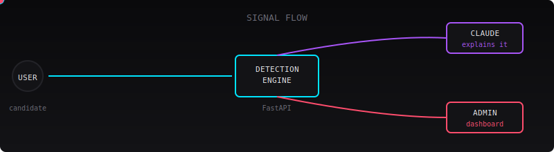
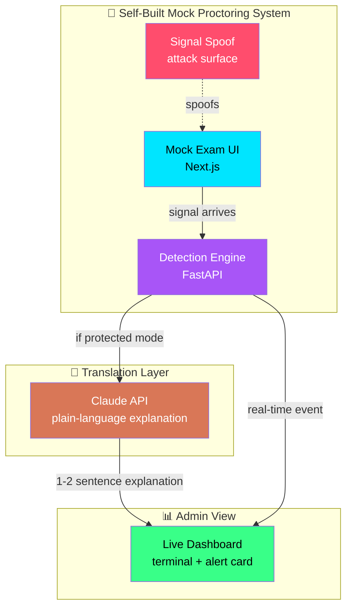
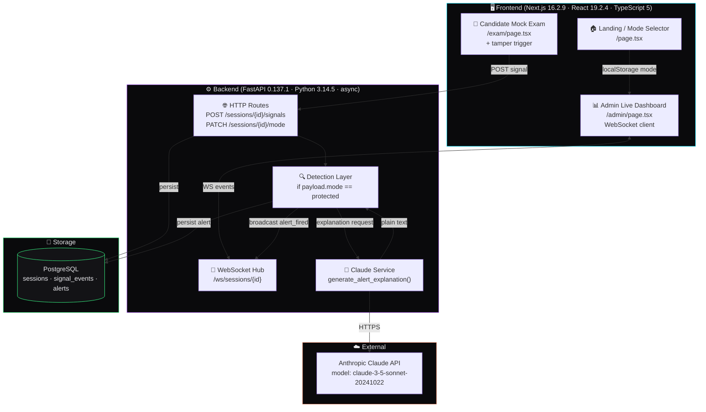
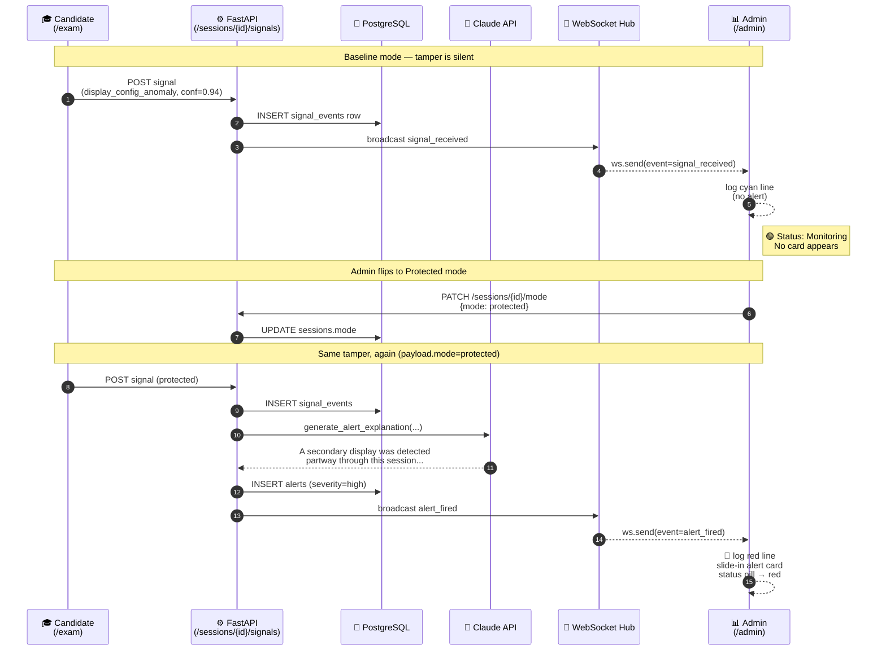
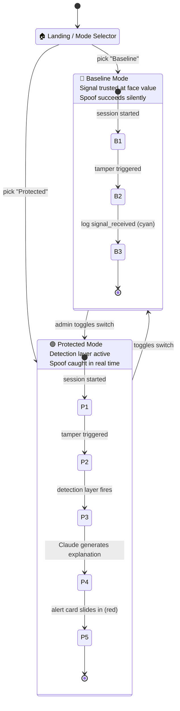
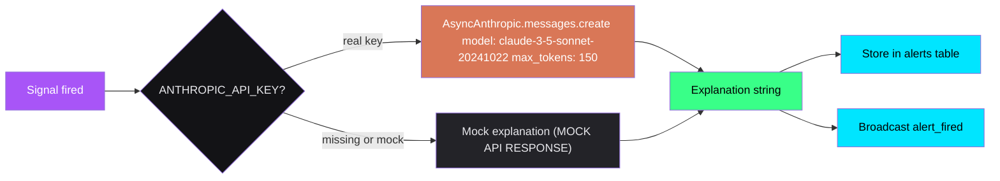
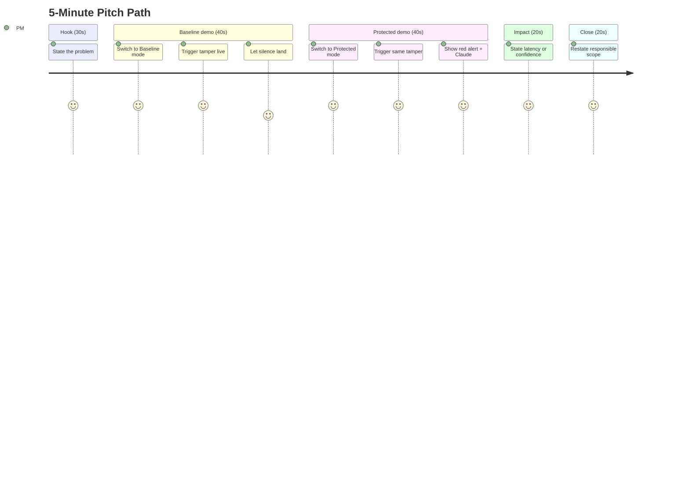
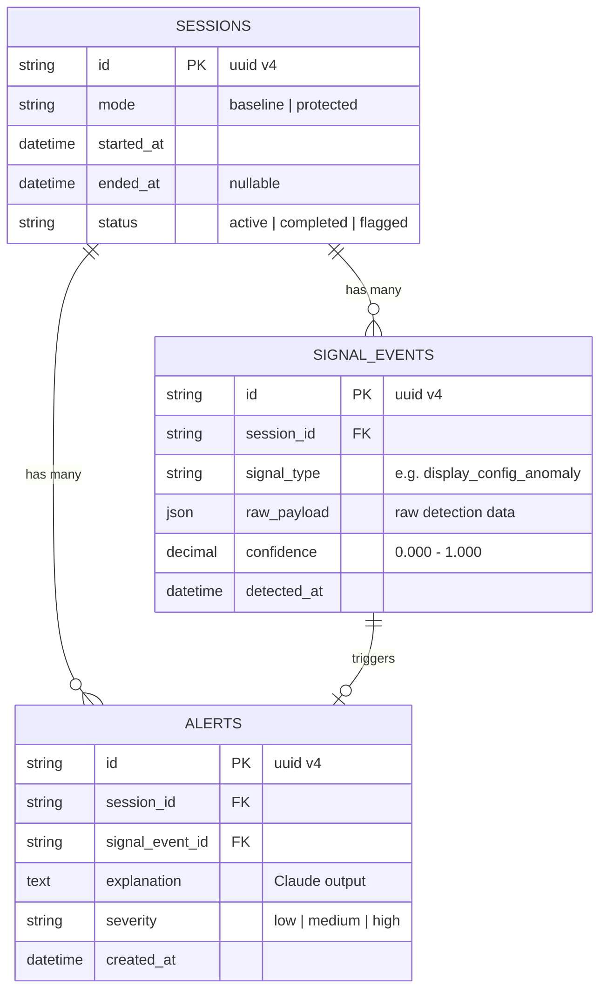

<div align="center">

# 🛡️ ShadowAudit

## *Proctoring Integrity Research & Auto-Detection System*

<p>
  
  
  
  
</p>

<p>
  
  
  
  
  
</p>

---

> **What this is, in one line:** A vulnerability-research proof-of-concept that detects a specific class of proctoring-signal tampering in real time, then explains the detection in plain language using Claude.
>
> **What this is not:** A tool to bypass any real commercial proctoring product. See [⚠️ Responsible Disclosure](#17-%EF%B8%8F-responsible-disclosure).

</div>

---

## 🎬 Visual Overview

<div align="center">



</div>

<p align="center"><sub>↑ A real detection packet flows from candidate → detection engine → Claude (for explanation) → admin dashboard, all in real time.</sub></p>

---

## 📚 Table of Contents

| | | |
| --- | --- | --- |
| 🧒 [1. What is ShadowAudit?](#1-what-is-shadowaudit-in-plain-english) | 🏗️ [7. Architecture](#7-architecture) | 📡 [13. API Reference](#13-api-reference) |
| 🚨 [2. The Problem](#2-the-problem--why-this-matters) | 🔄 [8. Data Flow](#8-data-flow--step-by-step) | 🗄️ [14. Database Schema](#14-database-schema) |
| 💡 [3. The Solution](#3-the-solution--what-we-built) | 🎬 [9. The Two Modes](#9-the-two-modes--baseline-vs-protected) | 📁 [15. Project Structure](#15-project-structure) |
| 🎯 [4. User Story](#4-user-story) | 🧠 [10. The AI Layer](#10-the-ai-layer--claude-integration) | 🛠️ [16. Troubleshooting](#16-troubleshooting) |
| ✨ [5. Features](#5-features-at-a-glance) | 🚀 [11. Getting Started](#11-getting-started) | ⚠️ [17. Responsible Disclosure](#17-%EF%B8%8F-responsible-disclosure) |
| 📐 [6. Scope Lock](#6-scope-lock) | 🧪 [12. Run the Demo](#12-run-the-demo) | 📜 [18. License & Credits](#18-license--credits) |

---

## 1. What is ShadowAudit? (in plain English)

**ShadowAudit** is a small research project that explores a question:

> *"When a proctoring tool says everything looks fine — is it because nothing went wrong, or just because nobody was watching carefully enough?"*

We built a **fake online exam** that demonstrates one specific way a candidate could fool a normal proctoring system (by spoofing a second display). Then we built a **detection layer** that catches the spoof in real time, and used **Claude** to translate the raw technical signal into a sentence a non-technical exam administrator can actually understand.

Think of it as a smoke detector for one specific kind of cheating — and an *interpreter* that explains what the alarm means.

> 🧒 **For absolute beginners:** Imagine a school test. Normally the teacher watches you the whole time. ShadowAudit is more like a small camera and a smart assistant — the camera catches a weird thing happening, and the assistant whispers to the teacher, *"Hey, the student just connected a second screen that wasn't there before."*

---

## 2. The Problem — Why This Matters

Online proctoring tools (used for certifications, university exams, remote job assessments) typically trust a handful of signals:

- 📷 **Webcam feed** — is there a face?
- 🖥️ **Screen count** — how many displays are connected?
- 🎯 **Tab focus** — is the candidate looking at the exam tab?
- 🔢 **Hardware IDs** — is this the same machine that registered?

Every one of these signals can be **spoofed** with off-the-shelf tools:

| Signal | Spoof technique | What the proctor sees |
| --- | --- | --- |
| Display count | Virtual display driver | "1 display" (lie) |
| Tab focus | Focus-event suppression | "Always focused" (lie) |
| Hardware ID | ID masking | "Same machine" (lie) |
| Webcam | Virtual camera | Loop a video of your face |

The **silent integrity gap** is this: most proctoring systems *trust the signal at face value* and never check whether the signal itself has been tampered with. The session is marked "clean" — but it wasn't.


**ShadowAudit** shows what it looks like to *catch* the spoof instead of trusting it.

---

## 3. The Solution — What We Built

We built a complete working demo with three pieces:



1. **Mock exam + spoof surface** — a tiny web-based "exam" that *can* be fooled by a display-config spoof (just like a real proctoring tool).
2. **Detection engine** — runs on the same signal a real proctoring tool would receive, but cross-checks it against a secondary signal that the spoof doesn't account for. In this PoC, the engine's only branching rule is `if payload.mode == "protected"` (see `backend/main.py`); the more sophisticated cross-signal correlation described in `shadowaudit.md` is the *design intent* and is left as a deliberate PoC simplification.
3. **Claude-powered translation** — when the engine fires, Claude writes a short, neutral, non-alarmist sentence describing what was detected, for an admin who is not a security expert.

---

## 4. User Story

> *"As an **exam administrator**, when a candidate tampers with their display configuration during a proctored session, I want to be alerted in real time with a **clear explanation** — instead of only seeing a clean session log."*

This is the entire product in one sentence. Every screen, every endpoint, and every animation in this repo exists to make that sentence demonstrable in under 5 minutes.

---

## 5. Features at a Glance

| Feature | Description |
| --- | --- |
| 🎚️ **Visible mode toggle** | Baseline vs Protected — judges can *see* you flip a switch, not just trust a verbal claim. |
| ⚡ **Real-time WebSocket** | Sub-2-second detection latency from tamper to dashboard alert. |
| 🧠 **Claude explanations** | Plain-language, 1-2 sentence alerts. Tone-neutral, no jargon, no accusation. |
| 🎨 **Dark editorial UI** | JetBrains Mono for data, clean sans for body. Cyan/violet/red accent system. |
| 🪟 **Inline alert card** | Slides in from the right with a 3px red border. No jarring modals. |
| 🛡️ **Offline-tolerant** | Works on a local network — no dependency on judge WiFi or external services (mock AI mode). |
| 🧱 **No bypass in public** | Tamper-trigger code can be gated behind an env var; default builds are detection-only. |

> ⚠️ **Honest framing:** This PoC ships a "Trigger Tamper" button directly in the candidate UI (`/exam`) and does *not* ship a feature-flag gate by default. Treat that button as a demo control, not production code. See [⚠️ Responsible Disclosure](#17-%EF%B8%8F-responsible-disclosure).

---

## 6. Scope Lock

We deliberately limited the demo to **one** specific class of tampering:

> **Secondary display / virtual monitor spoofing.**

| In scope ✅ | Out of scope ❌ |
| --- | --- |
| Display-config spoofing | Tab-switching detection |
| Cross-correlation of 2 signals | Gaze tracking |
| Plain-language explanation | Audio spoofing |
| Real-time dashboard push | Multi-session auth |
| | Targeting real third-party products |

This is a hackathon PoC, not a commercial product. Scope discipline keeps the demo tight and the framing honest.

---

## 7. Architecture



### Component Cheat Sheet

| Layer | Tech | Files | Why |
| --- | --- | --- | --- |
| **Frontend** | Next.js 16.2.9 (App Router), React 19.2.4, TypeScript 5 | `frontend/src/app/` | Two views: candidate (mock exam) + admin (live dashboard) |
| **Backend** | FastAPI 0.137.1 + uvicorn 0.49, async/await | `backend/main.py` | HTTP routes + WebSocket hub + detection trigger |
| **Database** | PostgreSQL via `databases` 0.9 + asyncpg 0.31 + SQLAlchemy 2.0.51 | `backend/database.py` | Three tables: `sessions`, `signal_events`, `alerts` |
| **AI** | Anthropic Python SDK 0.109 (`AsyncAnthropic`) | `backend/ai_service.py` | Translates raw signal → 1-2 sentence explanation |
| **Realtime** | Native FastAPI WebSocket | `backend/main.py::websocket_endpoint` | Pushes `signal_received` + `alert_fired` events |

---

## 8. Data Flow — Step by Step

Here's what happens, second by second, when a candidate tampers with their display:



### Two States, One Tamper

| Mode | What happens to the same signal | Visible result |
| --- | --- | --- |
| 🔵 **Baseline** | Stored in DB, broadcast as `signal_received` | Cyan log line `Incoming signal stream: <type>`. Status stays green. *Nothing else.* |
| 🟢 **Protected** | Same as above **plus**: Claude call, `alerts` row, `alert_fired` broadcast | Red log line `ANOMALY DETECTED: <type> [Confidence: …]`. Alert card slides in. Status pill turns red. |

> 💡 **That's the whole pitch in one comparison:** same action, two outcomes, because of one switch.

---

## 9. The Two Modes — Baseline vs Protected

The most important visual element in the demo is the **mode toggle itself**. Here's what judges see:

<div align="center">



</div>

### Side-by-side visual

<div align="center">



</div>

<p align="center"><sub>↑ Same button click. Left: nothing happens (Baseline). Right: alert card slides in (Protected).</sub></p>

---

## 10. The AI Layer — Claude Integration

Claude's **only job** in this product is *translation*, not detection. Detection is deterministic backend code; Claude just makes it human-readable.

### System Prompt (used in production)

The backend sends every alert through a single, locked-down system prompt:

> *"You are an integrity-alert assistant for an exam proctoring dashboard. You receive a structured signal event describing an anomaly detected during a proctored session. Your job is to explain it in 1-2 sentences to a non-technical exam administrator.*
>
> *Rules:*
>
> - *Never speculate about the candidate's intent (e.g., do not say 'the candidate was cheating'). Describe only what the signal shows.*
> - *Never explain the underlying bypass mechanism in technical detail. Describe the category only (e.g., 'a secondary display was detected that wasn't present at session start').*
> - *Keep tone neutral and factual, not accusatory.*
> - *Output should be short — max 2 sentences, no bullet lists, no markdown.*
> - *If signal confidence is below threshold, say so explicitly rather than overstating certainty."*

### Example Round-Trip

**Input** (JSON the backend sends to Claude):

```json
{
  "signal_type": "display_config_anomaly",
  "confidence": 0.94,
  "session_id": "demo-001",
  "detected_at": "2026-06-17T14:32:01Z"
}
```

**Output** (what the admin sees in the alert card):

> *"A secondary display was detected partway through this session that wasn't present when the exam started. Confidence in this detection is high (94%)."*

### What Claude Is NOT Asked to Do

- ❌ Make the detection decision (deterministic code does that)
- ❌ Generate new bypass techniques
- ❌ Speculate about intent ("they were cheating")
- ❌ Show in the candidate-facing UI (no chat exposure)

### Mock Mode

If `ANTHROPIC_API_KEY` is missing or set to `"mock"`, the service returns a deterministic mock string so the demo runs **with zero external dependencies**. Perfect for offline judging.



---

## 11. Getting Started

### Prerequisites

You need four things installed:

| Tool | Version | Check |
| --- | --- | --- |
| **Python** | 3.14+ | `python3 --version` |
| **Node.js** | 20+ | `node --version` |
| **PostgreSQL** | 14+ | `psql --version` |
| **npm** | 10+ | `npm --version` |

> 🪟 The backend venv ships with the core Python dependencies pre-installed under `backend/venv/` (FastAPI 0.137.1, uvicorn 0.49, asyncpg 0.31, `databases` 0.9, SQLAlchemy 2.0.51, psycopg2-binary 2.9, Pydantic 2.13, Anthropic SDK 0.109, python-dotenv 1.2). New contributors still need Postgres + Node on their machine.

### Clone & Enter

```bash
git clone <your-repo-url> ShadowAudit
cd ShadowAudit
```

### 1. Backend Setup

```bash
cd backend

# (optional) activate the prebuilt virtualenv
source venv/bin/activate

# configure environment
cp .env.example .env
# then edit .env:
#   DATABASE_URL=postgresql://localhost:5432/shadowaudit
#   ANTHROPIC_API_KEY=mock          # use "mock" to run without a real API key

# make sure Postgres is running and the DB exists
createdb shadowaudit   # or: psql -c "CREATE DATABASE shadowaudit;"

# start the API
uvicorn main:app --reload --host 0.0.0.0 --port 8000
```

You should see:

```text
INFO:     Uvicorn running on http://0.0.0.0:8000 (Press CTRL+C to quit)
INFO:     Started reloader process
INFO:     Started server process
INFO:     Waiting for application startup.
INFO:     Application startup complete.
```

Open `http://localhost:8000/docs` to see the auto-generated OpenAPI explorer.

### 2. Frontend Setup

In a **second terminal**:

```bash
cd frontend
npm install
npm run dev
```

You should see:

```text
   ▲ Next.js 16.2.9
   - Local:        http://localhost:3000
```

### 3. Open the App

Visit **<http://localhost:3000>** in your browser.

---

## 12. Run the Demo

### 30-Second Walkthrough

1. **Pick a mode** on the landing page — start with **Baseline** (cyan).
2. Click **"Start Demo Session"** — this opens the candidate exam tab in a new window and routes your current tab to the admin dashboard. (Your selected mode is also stashed in `localStorage` under `shadowaudit_mode` so the exam tab picks it up.)
3. On the **exam tab**, click the red **"Trigger Tamper Action (Virtual Display Spoof)"** button.
4. Switch back to the **admin tab**. You'll see a cyan log entry (`Incoming signal stream: display_config_anomaly`) but **no alert card** — that's the silent failure.
5. Click the **"Baseline / Protected"** toggle in the topbar of the admin page.
6. Go back to the exam tab and click **"Trigger Tamper Action"** again.
7. Within ~2 seconds, the admin dashboard logs a **red line** (`ANOMALY DETECTED: display_config_anomaly [Confidence: 0.94]`) and **slides in an alert card** with the Claude-written explanation. The status pill flips from green `Monitoring` to red `Alert Fired`.

### What You're Demonstrating

| Step | What it proves |
| --- | --- |
| Same exact action, two different outcomes | The detection layer is doing real work, not just decoration |
| ~2-second latency | Detection is real-time, not post-hoc |
| Plain-language alert | The AI layer adds value beyond raw signal data |
| Visible mode toggle | Judges can *see* the system changing, not just trust verbal claims |

### Demo Flow Diagram



---

## 13. API Reference

Base URL: `http://localhost:8000`

### REST Endpoints

#### `POST /sessions/{session_id}/signals`

Ingest a raw signal event from a candidate client.

**Request body:**

```json
{
  "mode": "protected",
  "signal_type": "display_config_anomaly",
  "raw_payload": {
    "reported_display_count": 1,
    "detected_rendering_contexts": 2,
    "jitter_ms": 45.2
  },
  "confidence": 0.94
}
```

**Response:**

```json
{ "status": "received", "event_id": "a1b2c3d4-..." }
```

**Side effects:**

- Inserts a row into `signal_events`.
- Broadcasts `signal_received` to all WebSocket clients.
- **If `payload.mode == "protected"`:** calls Claude, inserts an `alerts` row (severity is hard-coded to `high` in this PoC), and broadcasts `alert_fired`.

#### `PATCH /sessions/{session_id}/mode`

Update a session's operating mode mid-session.

**Request body:**

```json
{ "mode": "protected" }
```

**Response:**

```json
{ "status": "updated", "mode": "protected" }
```

### WebSocket

#### `WS /ws/sessions/{session_id}`

Persistent duplex connection. Server pushes JSON events; clients can send anything (kept alive, currently ignored).

**Event: `signal_received`**

```json
{ "event": "signal_received", "signal_type": "display_config_anomaly" }
```

> Note: the `signal_received` payload is the literal `{event, signal_type}` object above. The richer `{session_id, timestamp, …}` envelope only appears on `alert_fired`.

**Event: `alert_fired`**

```json
{
  "event": "alert_fired",
  "session_id": "demo",
  "signal_type": "display_config_anomaly",
  "confidence": 0.94,
  "explanation": "A secondary display was detected partway through this session that wasn't present when the exam started. Confidence in this detection is high (94%).",
  "timestamp": "2026-06-17T14:32:01.123456+00:00"
}
```

### Try It From curl

```bash
# Send a signal in Baseline mode (silent)
curl -X POST http://localhost:8000/sessions/demo/signals \
  -H "Content-Type: application/json" \
  -d '{
    "mode": "baseline",
    "signal_type": "display_config_anomaly",
    "raw_payload": {"reported_display_count": 1, "detected_rendering_contexts": 2, "jitter_ms": 45.2},
    "confidence": 0.94
  }'

# Now switch to Protected mode
curl -X PATCH http://localhost:8000/sessions/demo/mode \
  -H "Content-Type: application/json" \
  -d '{"mode": "protected"}'

# And send the same signal — this time you'll get an alert_fired event
curl -X POST http://localhost:8000/sessions/demo/signals \
  -H "Content-Type: application/json" \
  -d '{
    "mode": "protected",
    "signal_type": "display_config_anomaly",
    "raw_payload": {"reported_display_count": 1, "detected_rendering_contexts": 2, "jitter_ms": 45.2},
    "confidence": 0.94
  }'
```

---

## 14. Database Schema



### SQL (as implemented)

```sql
CREATE TABLE sessions (
    id VARCHAR PRIMARY KEY,           -- app-side uuid.uuid4() in current code
    mode VARCHAR(20) NOT NULL,        -- 'baseline' | 'protected'
    started_at TIMESTAMPTZ NOT NULL DEFAULT now(),
    ended_at TIMESTAMPTZ,
    status VARCHAR(20) NOT NULL DEFAULT 'active'
);

CREATE TABLE signal_events (
    id VARCHAR PRIMARY KEY,
    session_id VARCHAR NOT NULL REFERENCES sessions(id) ON DELETE CASCADE,
    signal_type VARCHAR(50) NOT NULL,
    raw_payload JSONB NOT NULL,
    confidence NUMERIC(4,3),
    detected_at TIMESTAMPTZ NOT NULL DEFAULT now()
);

CREATE TABLE alerts (
    id VARCHAR PRIMARY KEY,
    session_id VARCHAR NOT NULL REFERENCES sessions(id) ON DELETE CASCADE,
    signal_event_id VARCHAR NOT NULL REFERENCES signal_events(id),
    explanation TEXT NOT NULL,
    severity VARCHAR(20) NOT NULL DEFAULT 'medium',
    created_at TIMESTAMPTZ NOT NULL DEFAULT now()
);
```

> 📝 **Spec-vs-impl note:** The original spec calls for `UUID` columns with `gen_random_uuid()`. The implementation uses `String` PKs populated by `uuid.uuid4()` on the application side, which works identically with Postgres. The SQL shown above reflects what `metadata.create_all(engine)` actually emits; SQLAlchemy generates the `CREATE INDEX` statements for any declared indexes (none are declared in the current models, so the indexes shown above are *spec-intended* rather than emitted).

---

## 15. Project Structure

```text
ShadowAudit/
├── 📄 shadowaudit.md          ← Original project spec (PRD · TRD · AI · UI · Schema · Plan · Demo)
├── 📄 README.md               ← You are here
│
├── 📂 docs/assets/             ← SVG diagrams referenced by README
│   ├── signal-flow.svg        ← Animated hero: candidate → engine → Claude → admin
│   └── baseline-vs-protected.svg ← Side-by-side mode comparison
│
├── 🐍 backend/                ← FastAPI 0.137.1 · Python 3.14.5
│   ├── main.py                ← App entry: routes + WebSocket + lifecycle
│   ├── database.py            ← SQLAlchemy schema + async Database handle
│   ├── models.py              ← Pydantic request/response schemas
│   ├── ai_service.py          ← AsyncAnthropic client + system prompt + mock fallback
│   ├── .env.example           ← DATABASE_URL + ANTHROPIC_API_KEY template
│   ├── .gitignore             ← Excludes venv/, .env, __pycache__
│   └── venv/                  ← Pre-installed Python virtualenv
│
└── ⚛️  frontend/               ← Next.js 16.2.9 · React 19.2.4 · TypeScript
    ├── package.json
    ├── tsconfig.json
    ├── next.config.ts
    ├── eslint.config.mjs
    ├── next-env.d.ts
    ├── AGENTS.md              ← ⚠️ "This is NOT the Next.js you know" — read before editing
    ├── CLAUDE.md              ← @AGENTS.md
    ├── public/                ← Static SVGs shipped with the Next.js starter
    └── src/app/
        ├── layout.tsx         ← Root layout: fonts + metadata
        ├── globals.css        ← Design tokens + components + animations
        ├── page.module.css    ← Default starter CSS module (unused by the demo)
        ├── favicon.ico
        ├── page.tsx           ← Landing / Mode Selector
        ├── admin/
        │   └── page.tsx       ← Live dashboard: terminal + alert card
        └── exam/
            └── page.tsx       ← Mock exam + tamper trigger button
```

### Where to Look First

| If you want to understand… | Open this file |
| --- | --- |
| The product idea and scope | `shadowaudit.md` |
| How the API works | `backend/main.py` |
| How the database is shaped | `backend/database.py` |
| How Claude is called | `backend/ai_service.py` |
| What the admin sees | `frontend/src/app/admin/page.tsx` |
| What the candidate sees | `frontend/src/app/exam/page.tsx` |
| The visual style | `frontend/src/app/globals.css` |

---

## 16. Troubleshooting

<details>
<summary><b>🔴 Frontend shows "WebSocket connection failed"</b></summary>

Make sure the backend is running on port 8000 first. The frontend hardcodes `ws://localhost:8000`. If you changed the backend port, update `frontend/src/app/admin/page.tsx`.

</details>

<details>
<summary><b>🔴 "psql: error: connection to server failed"</b></summary>

PostgreSQL isn't running. On macOS: `brew services start postgresql`. Then `createdb shadowaudit` (or whichever DB name matches your `DATABASE_URL`).

</details>

<details>
<summary><b>🟡 Claude explanations show "(MOCK API RESPONSE)"</b></summary>

That's expected if `ANTHROPIC_API_KEY` is missing or set to `"mock"`. To use a real model, get an API key from [console.anthropic.com](https://console.anthropic.com) and put it in `backend/.env`.

</details>

<details>
<summary><b>🟡 "ANTHROPIC_API_KEY not set" warning in console</b></summary>

Same as above — harmless. The mock fallback returns a deterministic string so the demo still works end-to-end.

</details>

<details>
<summary><b>🔴 Next.js 16 build errors about deprecated APIs</b></summary>

This project intentionally uses Next.js 16, which has breaking changes from earlier versions. Read `frontend/AGENTS.md` and `frontend/node_modules/next/dist/docs/` before touching any Next-specific code. Common gotchas:

- Some App Router APIs moved
- Some server/client component boundaries changed
- Default config options may differ

</details>

<details>
<summary><b>🟡 Port 3000 or 8000 already in use</b></summary>

- Backend: `uvicorn main:app --port 8001` (also update frontend hardcoded URLs).
- Frontend: `npm run dev -- --port 3001`.

</details>

<details>
<summary><b>🔴 "relation does not exist" on first signal</b></summary>

The `init_db()` call runs from FastAPI's `@app.on_event("startup")` hook, so tables are created as soon as `uvicorn` boots — **before** the first request. If you still see this error, confirm the user in `DATABASE_URL` owns the database and that `shadowaudit` exists (`createdb shadowaudit`).

</details>

---

## 17. ⚠️ Responsible Disclosure

This is the **most important section** of the README. Please read it before sharing this project publicly.

### What this project IS

- ✅ A **vulnerability-research** + **auto-detection** proof of concept
- ✅ Demonstrated on a **self-built mock proctoring environment**
- ✅ Focused on **one** narrowly-scoped class of tampering (secondary display spoofing)
- ✅ Detection + explanation is the public-facing contribution
- ✅ Built to follow responsible-disclosure norms

### What this project IS NOT

- ❌ A tool to defeat any real, named commercial proctoring product
- ❌ A claim that this vector is the only one that exists
- ❌ A packaged exploit script for public reuse
- ❌ A replacement for proper end-user security review

### Memorize This (for live Q&A)

> *"We didn't target any real, named proctoring product. We built our own mock system specifically so we could study this class of vulnerability without touching production software anyone depends on. We're also not publishing the exact bypass method — only the detection capability — the same way security researchers handle responsible disclosure."*

### Never Show On Stage

- The exact bypass implementation code, line by line
- Any claim that a specific commercial product is vulnerable
- A public repo with bypass instructions reusable out of context

### Post-Hackathon Guidance

If continuing this project, consider:

- Keep the repo **private** until you've reviewed what's safe to publish
- Move tamper-trigger code to a **separate, access-gated module**
- Reframe public docs entirely around the **detection/explanation layer**
- Coordinate disclosure with any affected vendor through standard channels

---

## 18. License & Credits

### License

No license file is currently included. **All rights reserved** until a license is added. Add `LICENSE` (MIT or Apache-2.0 recommended) before any public release.

### Credits

Built with:

- ⚛️ [Next.js 16.2.9](https://nextjs.org/) · React 19.2.4 · TypeScript 5
- 🐍 [FastAPI](https://fastapi.tiangolo.com/) · Python 3.14.5 · Pydantic
- 💾 [PostgreSQL](https://www.postgresql.org/) · SQLAlchemy · asyncpg
- 🧠 [Anthropic Claude](https://www.anthropic.com/) (model: `claude-3-5-sonnet-20241022`)

### Spec-vs-Implementation Drift (for reviewers)

| Spec says | Code does | Impact |
| --- | --- | --- |
| `UUID` PKs with `gen_random_uuid()` | `String` PKs (rendered as `VARCHAR`) with app-side `uuid.uuid4()` | None — works identically |
| `claude-sonnet-4-6` | `claude-3-5-sonnet-20241022` | Use whichever is available; update one line in `ai_service.py` |
| Spec lists `idx_signal_events_session` + `idx_alerts_session` indexes | `metadata.create_all(engine)` doesn't emit them — model has no `Index()` declarations | Tables query fine for PoC scale; add indexes before any production traffic |
| `POST /sessions` to start a session | Session auto-created on first signal or `PATCH /sessions/{id}/mode` | Smaller surface; still demo-able |
| `GET /sessions/{id}/alerts` for history | Not implemented (admin relies on WS only) | Could be added later |

---

<div align="center">

### 🎤 Demo in 30 seconds?

```bash
# Terminal 1 — backend
cd backend && source venv/bin/activate && uvicorn main:app --reload

# Terminal 2 — frontend
cd frontend && npm run dev

# Then open http://localhost:3000 and follow Section 12.
```

---

<sub>Built for a 48-hour hackathon. Designed to be demoed in 5 minutes. Documented so a stranger can run it in 15.</sub>

<sub>🛡️ **ShadowAudit** — *trust, but verify the trust signal itself.*</sub>

</div>
